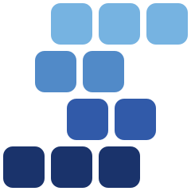

<p align="center">
    <a href="https://ja-plus.github.io/stk-table-solid/">
        
    </a>
    <h3 align='center'>Stk Table Solid</h3>
    <p align="center">
        <a href="https://www.npmjs.com/package/stk-table-solid"></a>
        <a href="https://www.npmjs.com/package/stk-table-solid"></a>
        <a href="https://github.com/ja-plus/stk-table-solid/stargazers"></a>
        <a href="https://raw.githubusercontent.com/ja-plus/stk-table-solid/main/LICENSE"></a>
        <a href="https://github.com/ja-plus/stk-table-solid"></a>
    </p>
</p>

Stk Table Solid(Sticky Table) is a high-performance virtual list component based on SolidJS.

Smooth performance with tens of thousands of rows.

Used for real-time data display, with data highlighting and dynamic effects.

## Documentation
### [Stk Table Solid Official](https://ja-plus.github.io/stk-table-solid/)
### [Stk Table Vue Official](https://ja-plus.github.io/stk-table-vue/)
### [Stk Table React Official](https://ja-plus.github.io/stk-table-react/)
### [Stk Table Svelte Official](https://ja-plus.github.io/stk-table-svelte/)

## Repo:
- [Github](https://github.com/ja-plus/stk-table-solid)

## Usage
> npm install stk-table-solid

```tsx
import { StkTable, type StkTableColumn, type StkTableInstance } from 'stk-table-solid';

type Data = {
    id: number;
    name: string;
    age: number;
    address: string;
};

export default function App() {
    let stkTableRef: StkTableInstance<Data> | undefined;

    const columns: StkTableColumn<Data>[] = [
        { title: 'name', dataIndex: 'name' },
        { title: 'age', dataIndex: 'age' },
        { title: 'address', dataIndex: 'address' },
    ];

    const dataSource: Data[] = [
        { id: 1, name: 'John', age: 32, address: 'New York' },
        { id: 2, name: 'Jim', age: 42, address: 'London' },
        { id: 3, name: 'Joe', age: 52, address: 'Tokyo' },
        { id: 4, name: 'Jack', age: 62, address: 'Sydney' },
        { id: 5, name: 'Jill', age: 72, address: 'Paris' },
    ];

    // highlight row
    stkTableRef?.setHighlightDimRow([rowKey], {
        method: 'css' | 'animation', // default animation
        className: 'custom-class-name', // for method 'css'
        keyframe: [{ backgroundColor: '#aaa' }, { backgroundColor: '#222' }], // same as https://developer.mozilla.org/en-US/docs/Web/API/Web_Animations_API/Keyframe_Formats
        duration: 2000,
    });
    // highlight cell
    stkTableRef?.setHighlightDimCell(rowKey, colDataIndex, {
        method: 'css' | 'animation',
        className: 'custom-class-name', // for method 'css'
        keyframe: [{ backgroundColor: '#aaa' }, { backgroundColor: '#222' }], // for method 'animation'
        duration: 2000,
    });

    return <StkTable ref={i => (stkTableRef = i)} rowKey="id" columns={columns} dataSource={dataSource} />;
}
```

## API
* [Props](https://ja-plus.github.io/stk-table-solid/main/api/table-props.html)

* [Emits](https://ja-plus.github.io/stk-table-solid/main/api/emits.html)

* [Slots](https://ja-plus.github.io/stk-table-solid/main/api/slots.html)

* [Expose](https://ja-plus.github.io/stk-table-solid/main/api/expose.html)

* [StkTableColumn: Define column type](https://ja-plus.github.io/stk-table-solid/main/api/stk-table-column.html)

* [Highlight: setHighlightDimCell & setHighlightDimRow](https://ja-plus.github.io/stk-table-solid/main/api/expose.html#sethighlightdimcell)

### Example
```tsx
import { StkTable, type StkTableColumn } from 'stk-table-solid';

const columns: StkTableColumn<any>[] = [
    {
        title: 'Name',
        dataIndex: 'name',
        fixed: 'left',
        width: '200px',
        headerClassName: 'my-th',
        className: 'my-td',
        sorter: true,
        customHeaderCell: props => (
            <span style="overflow:hidden;text-overflow:ellipsis;white-space:nowrap">
                {props.col.title + '(render) text-overflow,'}
            </span>
        ),
        customCell: props => <div>{props.cellValue}</div>,
    },
];

export default function Example() {
    return (
        <StkTable
            rowKey="name"
            columns={columns}
            dataSource={dataSource}
            style="height:200px"
            theme="dark"
            bordered="h"
            rowHeight={28}
            showOverflow={false}
            showHeaderOverflow={false}
            sortRemote={false}
            colResizable
            headerDrag
            virtual
            virtualX
            noDataFull
            autoResize
            fixedColShadow
            colMinWidth={10}
            headless={false}
            onCurrentChange={onCurrentChange}
            onRowMenu={onRowMenu}
            onHeaderRowMenu={onHeaderRowMenu}
            onRowClick={onRowClick}
            onRowDblclick={onRowDblclick}
            onSortChange={handleSortChange}
            onCellClick={onCellClick}
            onHeaderCellClick={onHeaderCellClick}
            onScroll={onTableScroll}
            onScrollX={onTableScrollX}
            onColOrderChange={onColOrderChange}
        />
    );
}
```
